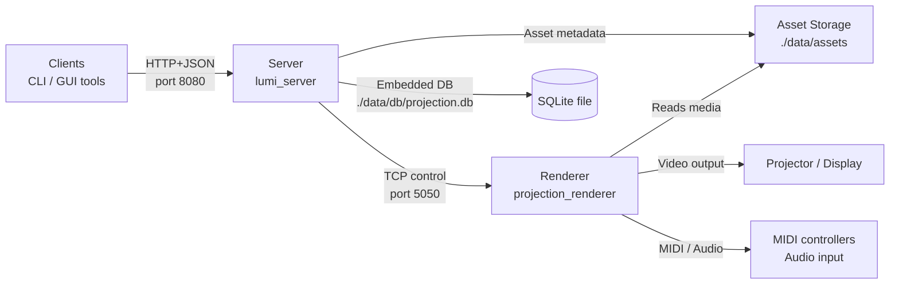
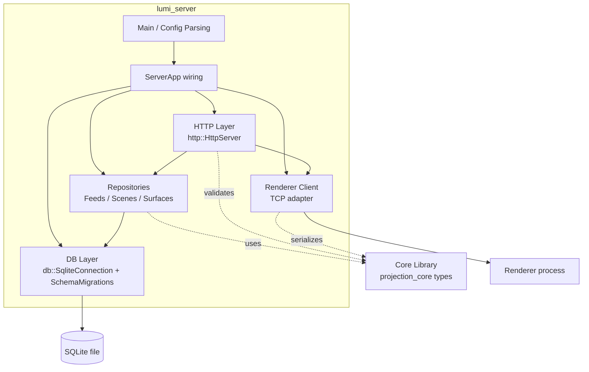
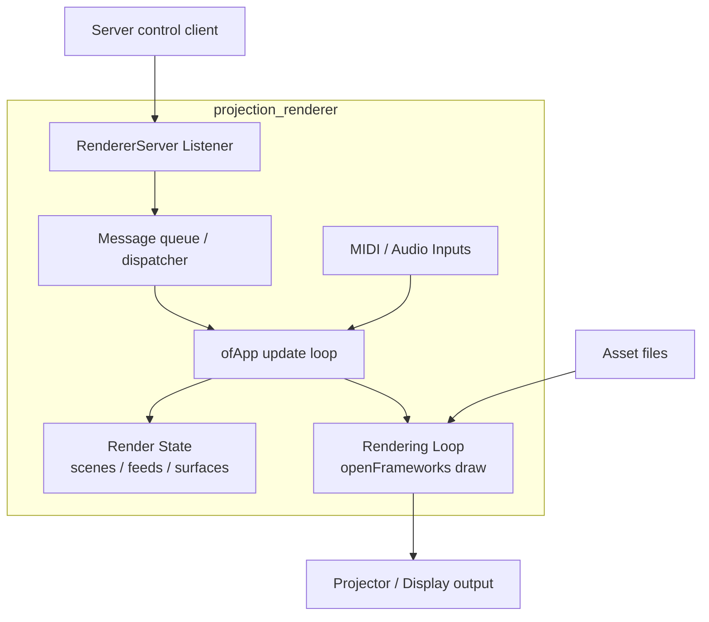

# System Architecture

This document summarizes the current architecture of the projection/video mapping stack and how the main pieces collaborate.

## Container/Context View
- **Diagram (Container level)**:

- **Clients**: External tools (CLI/GUI) that manage feeds, surfaces, scenes, and playback through the Server’s HTTP+JSON API.
- **Server (`lumi_server`)**: C++ service that exposes HTTP endpoints, orchestrates persistence, and forwards control commands to the Renderer.
- **Renderer (`projection_renderer`)**: openFrameworks-based process that receives control protocol messages and renders the active scene on the projector/display.
- **Core Library (`projection_core`)**: Shared C++ domain model (scenes, surfaces, feeds, cues) with JSON serialization/validation used by both Server and Renderer.
- **SQLite Database**: Embedded file-backed DB (`./data/db/projection.db`) used by the Server for durable state.
- **Asset Storage**: Filesystem directory (e.g., `./data/assets`) holding video/image assets referenced by feeds.

## High-Level Data & Control Flows
1. **Client → Server (HTTP+JSON)**: Clients call the HTTP API to manage domain objects and drive the renderer.
   - Feeds: `POST /feeds` creates a feed; `GET /feeds` lists feeds.
   - Scenes: `POST /scenes` creates a scene (validated against existing feeds); `GET /scenes` lists scenes; `GET /scenes/{id}` fetches one.
   - Projects: `POST /projects` creates a project (ordered `cueOrder` plus settings), `GET /projects` lists projects, `GET /projects/{id}` fetches one, `PUT /projects/{id}` updates, `DELETE /projects/{id}` removes; cues used by projects cannot be deleted.
   - Renderer control: `POST /renderer/ping` issues a `Hello` control message round-trip; `POST /renderer/loadScene` asks the renderer to load a stored scene definition; `POST /demo/two-video-test` seeds demo feeds/surfaces and streams them to the renderer.
2. **Server → SQLite**: The Server initializes a `db::SqliteConnection`, applies migrations, and persists feeds/scenes through repositories before serving HTTP (`ServerApp::run`).
3. **Server → Renderer (TCP Control Protocol)**: `RendererClient` connects at startup, then sends control messages such as `LoadSceneDefinition` over TCP (default renderer port 5050).
4. **Renderer → Projector/Display**: The Renderer draws the active scene using openFrameworks, applying MIDI/audio-driven modulation where configured.
5. **Assets on Disk**: Feed definitions reference files under `./data/assets`; the Renderer reads the media directly when playing video feeds.

## Server Component View
- **Diagram (Component level)**:

- **Main/Configuration**: Entry point parses CLI flags (DB path, HTTP port, renderer host/port) and wires dependencies.
- **HTTP Layer**: Thin cpp-httplib wrapper (`http::HttpServer`) exposes routes for feeds, scenes, and renderer control; requests translate into domain operations.
- **Repositories & DB Layer**: `db::SqliteConnection` plus schema migrations back repositories that CRUD feeds and scenes while enforcing validation against feed IDs.
- **Renderer Client Adapter**: `RendererClient` connects during startup and maps HTTP handler intents (ping, load scene, demo scene) to protocol messages before HTTP serving begins.
- **Domain Integration**: Uses the core library’s types and JSON helpers to validate payloads and serialize messages consistently across layers.

## Renderer Component View
- **Diagram (Component level)**:

- **RendererServer Listener**: Accepts TCP connections and decodes newline-delimited control protocol messages from the Server (port from `RENDERER_PORT` env or default 5050).
- **Render State Management**: `ofApp` updates in-memory scene/feed/surface state when new messages arrive (e.g., `loadSceneDefinition`).
- **Input Handlers**: MIDI via `ofxMidi` and audio via `ofxFft` modulate render parameters (brightness, scale, etc.).
- **Rendering Loop**: openFrameworks draw loop composites video feeds onto quads/meshes and outputs to the projector window.

## Deployment Notes
- Default ports: HTTP API on **8080**; renderer control on **5050**.
- Both binaries can run on the same machine (typical for projector hosts) or separate hosts if networked.
- The SQLite DB file is local to the Server process; no external DB service is required.
- Mount or preserve `./data/db` and `./data/assets` to keep state and media between runs.
