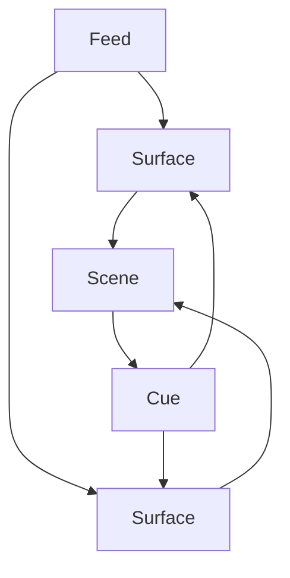

# projection-mapper

A modular, open-source **projection/video mapping engine** written primarily in **C++**, designed to run on **Raspberry Pi** and **macOS**.

- Render multiple real-time **video feeds** onto **skewed rectangles/quads/meshes**.
- Control playback and parameters via **MIDI**, **audio analysis (FFT)**, LFOs, and **remote clients**.
- Persist **scenes, surfaces, feeds, cues** and configuration in **PostgreSQL**.
- Use a **client–server model** so the machine connected to the projector can be controlled from other devices.

> 📌 Architecture & conventions for agents and humans are documented in [`AGENTS.md`](./AGENTS.md).  
> If you change anything important in the architecture, update `AGENTS.md` in the same PR.

---

## High-Level Architecture

The project is a C++-centric monorepo with four main components:

- **`/core` – Core Library**
  - Pure C++ domain model and logic.
  - Knows about: Scenes, Surfaces, Feeds, Cues, Layers, Playback state.
  - No rendering, DB, or networking dependencies.

- **`/server` – Server**
  - C++ server built on top of the core library.
  - Persists state to **PostgreSQL** and manages asset metadata.
  - Exposes a **remote API** over TCP/IP for clients.
  - Talks to the Renderer via a local **control protocol** (JSON over TCP in v0).

- **`/renderer` – Renderer**
  - C++ application using **openFrameworks**, `ofxPiMapper`, `ofxMidi`, `ofxFft`.
  - Runs on the machine that is physically connected to the **projector**.
  - Receives commands from the server and renders scenes in real time.

- **`/clients` – Clients**
  - C++ CLI and/or GUI tools.
  - Talk only to the **server** via its remote API.
  - Used to manage scenes, feeds, surfaces, cues, and playback.

Assets (images, video files, etc.) are stored on the filesystem (e.g. `./data/assets`), while structured state lives in PostgreSQL.

---

## Core domain overview

The core library models a few key entities that the server, renderer, and clients share:

- **Feed** – a source of pixels (video file, camera, generated content) with configuration metadata.
- **Surface** – a quad/mesh on the projector mapped to a particular Feed with blend/opacity controls.
- **Scene** – a collection of Surfaces configured together for playback.
- **Cue** – references a Scene and optionally overrides surface parameters (opacity/brightness) when triggered.



---

## Repository Layout (Initial)

```text
/AGENTS.md                 # Architecture & rules for agents and humans
/README.md                 # This file
/CMakeLists.txt            # Top-level CMake

/core/                     # Core C++ library (domain + protocol)
/core/src/...
/core/tests/...

/server/                   # C++ server using core + PostgreSQL
/server/src/...
/server/tests/...
/server/CMakeLists.txt
/server/Dockerfile         # Server Docker image

/renderer/                 # C++ openFrameworks renderer
/renderer/src/...
/renderer/tests/...
/renderer/addons.make...   # or openFrameworks project files

/clients/                  # Client apps (CLI, GUI, etc. in C++)
/clients/cli/...
/clients/gui/...

/data/                     # Default data dir (for local dev)
/data/assets/              # Media assets
/data/tmp/                 # Temp/cache files
